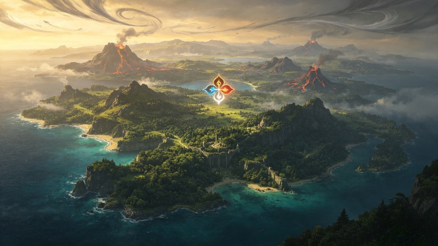
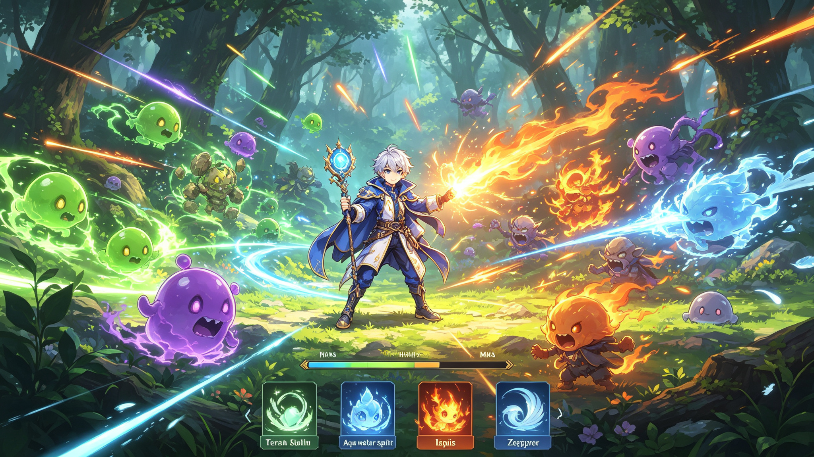

<div align="center">

# ELEMENTAL SPIRIT

### Bind the Spirits. Master the Elements. Restore Elaria.



**2D Action Shooter / RPG**

[](https://dotnet.microsoft.com/)
[](https://learn.microsoft.com/dotnet/desktop/winforms/)
[](#)

</div>

---

## About

**Elemental Spirit** is a 2D action shooter RPG developed with **C# and Windows Forms**.

The game takes place in **Elaria**, a world protected by four ancient elemental spirits:

* Terra — Earth
* Aqua — Water
* Ignis — Fire
* Zephyr — Wind

When the elemental balance is broken, **Arin**, an Elemental Mage, begins a journey to restore the Spirits and uncover the truth behind the corruption.

---

## Features

* Player movement and combat
* Elemental Spirit system
* Spirit Bond mechanic
* Enemy AI and wave system
* Boss battles
* Equipment and progression
* Shop and upgrade system
* JSON save system
* Story and dialogue system

---

## World

| Region       | Spirit | Boss           |
| ------------ | ------ | -------------- |
| Earth Forest | Terra  | Golem Guardian |
| Water Ruins  | Aqua   | Leviathan      |
| Fire Volcano | Ignis  | Inferno Dragon |
| Wind Temple  | Zephyr | Storm Phoenix  |
| Ancient Core | -      | Primordial     |

---

## Gameplay

<p align="center">
  
</p>

---

## Controls

| Key               | Action           |
| ----------------- | ---------------- |
| `A / Left Arrow`  | Move Left        |
| `D / Right Arrow` | Move Right       |
| `W / Up Arrow`    |  Jump            |
| `Space`           |  Attack          |
| `1`               | Spirit Ability 1 |
| `2`               | Spirit Ability 2 |
| `ESC`             | Pause            |

---

## Tech Stack

```text
C#
.NET
Windows Forms
GDI+ / System.Drawing
Object-Oriented Programming
MVP
Strategy Pattern
Factory Pattern
JSON
```

---

## Project Structure

```text
ElementalSpirit/
├── Presentation/
├── Domain/
├── GameEngine/
├── AI/
├── Factories/
├── Services/
├── Data/
└── Resources/
```

---

## Run

```bash
git clone <repository-url>
cd ElementalSpirit
dotnet restore
dotnet run
```

---

## Roadmap

* [x] Core gameplay
* [x] Player system
* [x] Spirit system
* [ ] More stages
* [ ] More enemies
* [ ] Boss battles
* [ ] Story intro
* [ ] Dialogue system
* [ ] Audio system

---

<div align="center">

### ELEMENTAL SPIRIT

**The balance is broken.**

**The journey begins.**

</div>
