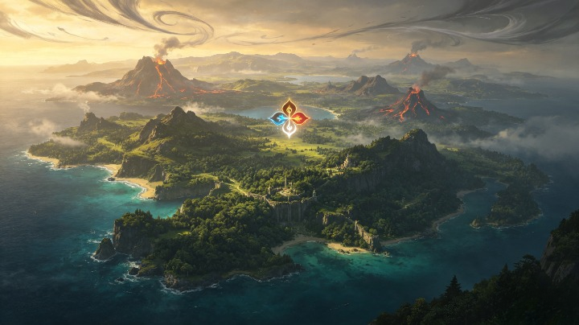
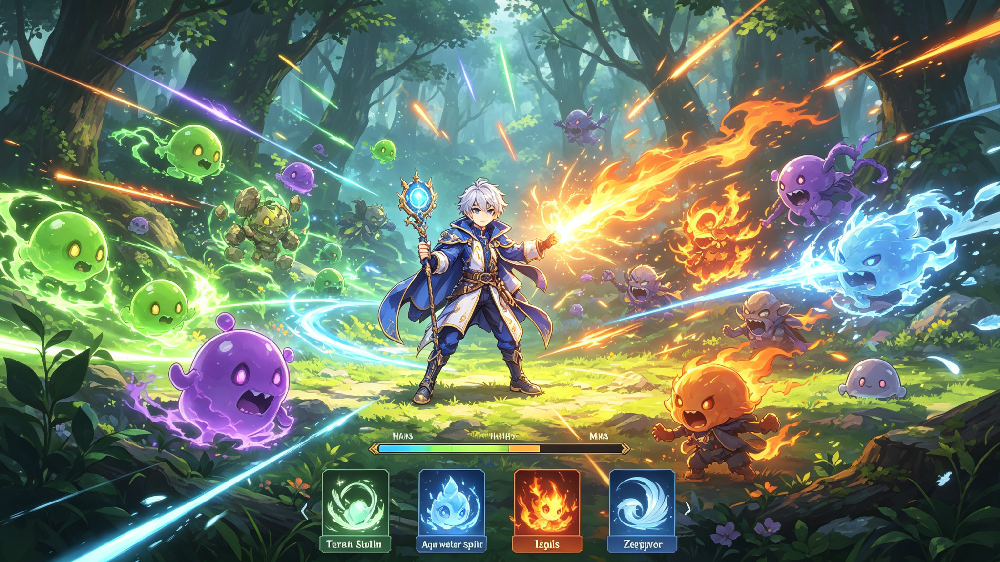

<div align="center">

# ELEMENTAL SPIRIT

### Kết nối các Tinh Linh. Làm chủ nguyên tố. Khôi phục Elaria.



**Game hành động bắn súng / nhập vai 2D**

[](https://dotnet.microsoft.com/)
[](https://learn.microsoft.com/dotnet/desktop/winforms/)
[](#)

</div>

---

## Giới thiệu

**Elemental Spirit** là game hành động nhập vai 2D được phát triển bằng **C# và Windows Forms**.

Trò chơi diễn ra tại **Elaria**, thế giới được bảo vệ bởi bốn Tinh Linh nguyên tố cổ đại:

* Terra — Đất
* Aqua — Nước
* Ignis — Lửa
* Zephyr — Gió

Khi cân bằng nguyên tố bị phá vỡ, Pháp Sư Nguyên Tố do người chơi đặt tên bắt đầu hành trình khôi phục các Tinh Linh và khám phá sự thật đằng sau sự tha hóa.

## Tính năng

* Di chuyển, chiến đấu và sử dụng kỹ năng nguyên tố
* Hệ thống Tinh Linh và cơ chế liên kết Tinh Linh
* Kẻ địch có AI và các đợt quái
* Các trận chiến với boss
* Phụ kiện và hệ thống phát triển nhân vật
* Cửa hàng và nâng cấp
* Lưu tiến trình bằng JSON
* Bảng thành tích lưu bằng tệp, xếp hạng theo số màn vượt qua rồi đến tổng vàng đã nhặt
* Cốt truyện và hội thoại
* Chế độ toàn màn hình và tùy chọn âm thanh
* Hướng dẫn chơi và thông tin nhóm thực hiện trong menu

## Thế giới

| Khu vực | Tinh Linh | Boss |
| --- | --- | --- |
| Rừng Đất | Terra | Mãng Xà Gordor |
| Tàn Tích Nước | Aqua | Leviathan |
| Núi Lửa Lửa | Ignis | Rồng Lửa |
| Đền Gió | Zephyr | Phượng Hoàng Bão |
| Lõi Cổ Đại | — | Primordial |

## Hình ảnh trò chơi

<p align="center">
  
</p>

## Hướng dẫn điều khiển

| Phím | Chức năng |
| --- | --- |
| `A` / `←` | Di chuyển sang trái |
| `D` / `→` | Di chuyển sang phải |
| `W` / `↑` | Nhảy |
| `Space` / `J` | Tấn công |
| `1` / `2` | Sử dụng kỹ năng |
| `B` | Mở cửa hàng |
| `U` | Mở nâng cấp |
| `P` | Mở cài đặt; trong game có thể lưu tiến trình |
| `N` | Chuyển sang đợt quái tiếp theo |
| `G` | Nhận vàng và mảnh Tinh Linh thử nghiệm |
| `ESC` | Thoát lượt chơi hiện tại |

### Bắt đầu một lượt chơi

1. Chọn **Bắt đầu** và nhập tên nhân vật.
2. Xem phần mở đầu hoặc dùng `Space` / chuột để tiếp tục, `Tab` để bỏ qua cảnh hiện tại, `Esc` để bỏ qua phần mở đầu.
3. Dùng các phím di chuyển, nhảy, tấn công và kỹ năng để vượt qua đợt quái.
4. Thu thập tài nguyên, sử dụng cửa hàng và nâng cấp để chuẩn bị cho các thử thách tiếp theo.
5. Lưu tiến trình trong phần cài đặt nếu muốn tiếp tục lượt chơi sau.

Kết quả chỉ được ghi vào `Saves/leaderboard.json` khi người chơi thua, lưu game hoặc đánh bại boss cuối. Thoát lượt chơi chưa lưu sẽ không được tính thành tích. Lưu lại một lượt chơi sẽ cập nhật kết quả của lượt đó thay vì tạo bản ghi trùng.

Bảng xếp hạng ưu tiên số màn đã vượt; nếu bằng nhau, lượt có tổng vàng nhặt được cao hơn sẽ xếp trên. Vàng đã tiêu không làm giảm tổng vàng dùng để xếp hạng.

Lỗi ứng dụng không xử lý được được ghi tại `%LOCALAPPDATA%\ElementalSpirit\Logs\application.log`.

## Nhóm thực hiện

| Họ và tên | MSSV | Lớp |
| --- | --- | --- |
| Hoàng Trung Nam | 44.01.104.145 | 48.01.CNTT.B |
| Lê Thị Vân Anh  | 46.01.103.007 | 48.01.TIN.SPA|
| Lê Thanh Tú     | 50.01.104.172 | 50.01.CNTT.B |
| Hồ Thị Mỹ Thuận | 50.01.104.157 | 50.01.CNTT.A |

## Công nghệ

```text
C#
.NET
Windows Forms
GDI+ / System.Drawing
Lập trình hướng đối tượng
MVP
Strategy Pattern
Factory Pattern
JSON
```

## Cấu trúc dự án

```text
ElementalSpirit/
├── Presentation/
├── Domain/
├── GameEngine/
├── AI/
├── Factories/
├── Services/
├── Data/
└── Resources/
```

## Chạy dự án

```bash
git clone <repository-url>
cd ElementalSpirit
dotnet restore
dotnet run
```

Ứng dụng yêu cầu Windows và .NET SDK tương thích với target framework được khai báo trong tệp dự án.

---

<div align="center">

### ELEMENTAL SPIRIT

**Cân bằng đã bị phá vỡ.**

**Hành trình bắt đầu.**

</div>
